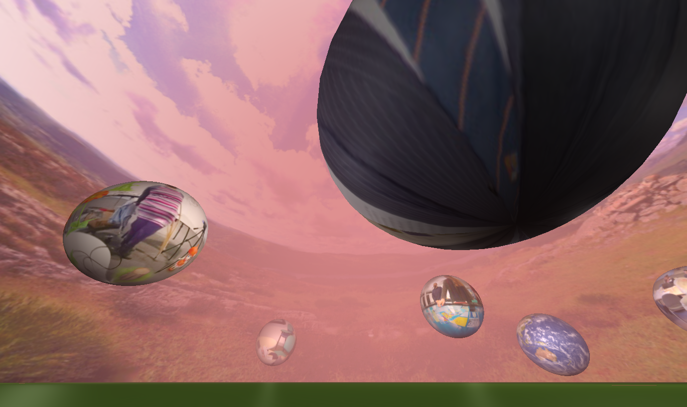

#Coding a Virtual Landscape in HTML and JavaScript

##Introduction

The Digital Humanities Hub hold regular events for anyone interested in their work, which are known as CAKE events. In June 2016 the topic of the CAKE was 'Digital Landscapes' and so the code here was written for it as a demonstration of how to use HTML and JavaScript to create an engaging online 3D landscape. It was intended that the code could be used by others, using their own images and sound, as a quick way to create their own navigable (using a gamepad/joystick or keyboard) environment for their own projects and work, as well as to extend or amend as they see fit. For that reason we decided to make all the code open-source for anyone to download.

##Using and navigating the virtual landscape

Using our digital landscape is as simple as putting it on a website and navigating a modern HTML5 web-browser to the index.html file (all the files in the webcode folder go in one folder on the website). However, you'll need to replace our placeholder images with your own, although we've left the Lake District background (for copyright reasons we've not included our 'virtual memory' images of people who've visited the Digital Humanities Hub). Downloading the images will take some time, depending on the speed of your web connection, as the HTML pages preload them. However, the browser should cache them, so the scene should appear much more quickly next time you open the page.

The scene can be navigated in two ways: using a gamepad/joystick, or using a keyboard. The scene was written specifically to take advantage of the Gamepad API so will exclusively use the gamepad for control if one is connected. The left analog-axes (i.e. little joystick) on the gamepad controls movement up down, left and right, and the bumper buttons at the back should make you rise into the air. If you have axes on the right (i.e. a gamepad with two little joysticks) then use you move that up and down to look up and down. If you don't you can look up and down using the left axes while pressing button 1, which is a 'second function' button (if your gamepad has a button 'Analog' then you'll likely find this works much better if you turn that one).

However, not everyone has a gamped so we included keyboard controls as a fallback. The keyboard control keys are:

* **Arrow keys:** Use the arrow keys on your keyboard to go forwards or backwards, and to turn left or right.
* **Space:** Use your space key to rise up into the air.
* **Q and A:** Use your Q and A keys to look up or down.

You can also use your mouse to double click the scene to toggle between a window and fullscreen mode. You should also be able to do that in your web-browser menu, but we decided to add the double click code as it makes it easier to get full screen on some devices.

Whichever method of control you choose, you'll find that you'll go much slower on the ground due to friction. So to go faster you need to rise up into the air. To allow you to glide around the scene, as long as you don't go too slowly you can stop using the rise button and you'll stay at a constant height. That means you have control of going up, but gravity has control of you going down (i.e. the only way down is to fall). So if you want to reduce height, just slow down and then speed up when you get to the height you want. It adds a more natural feel to navigating the scene and it's similar to what birds do so it's fun.

##Viewing the landscape with stereoscopic screens and glasses

As well as the normal computer graphics found in index.html the landscape was intended to be viewable on 3D screens too. So, there are four other HTML files that cover the following viewing methods:

* **stereo.html:** This version draws two views of the scene side by side. Many 3D screens, especially 3D TVs, can display stereoscopic graphics this way. So if you have a computer connected to your 3D TV (or can wirelessly cast to one) you should be able to set your TV to 3D mode and select the option of side-by-side viewing. This version also squashed the views to allow for the fact that the TV will scale them by 100% horizontally to fit the screen.
* **anaglyph.html:** This version can be used on any computer display and requires only a pair of the red-cyan glasses that are often provided with 3D movies and books. Because the coloured lenses in those glasses don't completely block light intended for the opposite eyes, the effect isn't as good as the other 3D viewing methods. However, if you don't have another option then you should still be able to successfully view the scene in 3D.
* **cardboard.html:** This version is intended for use with Google Cardboard headsets, such as the ViewMaster Virtual Reality headset. That means you should be able to use it with any smartphone that has a Cardboard-compatible viewing app, rather than just on Android phones. You'll obviously need an external keyboard or gamepad to navigate the scene, but these can be picked up very cheaply online.
* **oculus.html:** This version is much the same as the Cardboard version, but is set up for use with the Oculus Rift virtual reality headset. As Oculus have dropped the ability to use a Rift as an external monitor, to use this you'll either need an Oculus-compatible browser (see online for details of the latest VR enabled versions of Chrome and Firefox) or older Oculus drivers so you can duplicate your PC screen onto the headset displays.

Stereoscopic setups are likely to rely on the full screen area being used, to display properly. You can do that by making the web-browser go fullscreen using a menu option or just by double clicking on the 3D scene.

##Some notes on the gamepad code

One of the exciting aspects of our scene is the ability to navigate it using a gamepad or joystick (wired or wireless). That makes for a much smoother and simpler experience than simply using a mouse or keyboard. However, the Gamepad API, while being an official web-specification, isn't fully implemented in all browsers. So, to use it you need a pretty modern HTML5 web-browser. We've tested it on the latest Chrome and Firefox browsers and it works fine. On older browsers like Internet Explorer 11 evrything works except the gamepad, but the scene can be navigated with the keyboard controls. We also successfully tested it on Chrome for Android using a Bluetooth gamepad.

At the time of writing Chrome does have some issues associated with it not having fully incorporated the gamepad connected and disconnected events. In cake3d.js you'll notice that leads to the need for a timer to poll for connected gamepads. According to what we've read on the web, simply polling for a gamepad at index zero should then allow us to connect to the most recently plugged-in gamepad. However, we found that the most recently plugged-in gamepad didn't always arrive at index zero, and when it did it could easily change to another index after the page was refreshed. To make things worse, Chrome seems to sometimes report that a gamepad is connected when it isn't, which especially appears to be a problem with Bluetooth gamepads.

So you'll notice that we've overcome those problems by occasionally checking for the first index that has a gamepad with a non-zero timestamp. It's a bit of a fudge, but seems to work well, but in future versions of Chrome this may need changing (hopefully not, but we mention it just in case). In Firefox, which seems to have fully incorporated the Gamepad API, we had no such problems as the gamepad connected and disconnected events did their jobs perfectly.

##About the Digital Humanities Hub

The Digital Humanities Hub focuses on collaborative triple helix working across the Arts and Humanities with cultural and heritage organisations, digital and creative industries and academics to develop collaborative and innovative digital prototypes. It is based on the University of Birmingham's Edgbaston Campus in the UK and you can visit the Hub's website at http://www.birmingham.ac.uk/facilities/digitalhumanitieshub/index.aspx

##Credits

This piece of work was inspired and motivated by collaboration with the 'Mapping the Lakes' project, which is part of the ‘Geospatial Innovation in the Digital Humanities’ initiative (see http://wp.lancs.ac.uk/lakesdeepmap/) involving Lancaster University and the University of Birmingham.

The Lake District panorama was photographed by Chris Donaldson from the 'Mapping the Lakes' project. He took it on Beacon Fell and the lake is Coniston Water from the south. The three higher summits to the west of the lake are Dow Crag, Coniston Old Man, and Wetherlam.

Programming of the 3D scene used the excellent Three.js JavaScript library at http://threejs.org/ and the Google Cardboard, stereo and anaglyph effects came from it too. We've adapted the three.js file (at lines 17400 to 17403) to allow the eye separation to be adjusted in the stereo camera, and so renamed it cake_three.js. That helps give a better stereo effect for a large scene.

The Oculus Rift effect was based on the one written by troffmo5 on GitHub (http://github.com/troffmo5). It's basically as found on GitHub but changed slightly (at lines 124 to 127) to allow for some change in the eye separation for a better 3D effect on the Oculus Rift).

Of course, all programmers need help from their peers occasionally to iron out all the little cross-browser problems, and to work out how to use new features like the Gamepad API. So we'd also like to thank the multitude of web-authors who provided code, details and advice on their pages, including those on sites such as CodeProject and StackOverflow.

Concept and development by Andrew Thomas and Lara Ratnaraja from the Digital Humanities Hub.

Coding and graphics by Andrew Thomas.

